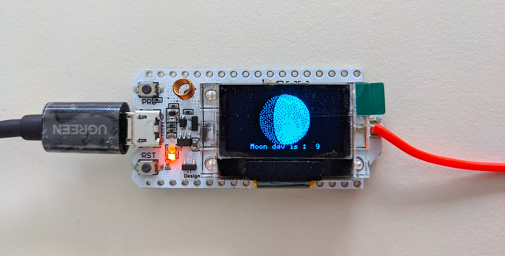

# Moon Phase Calculator

## Contents
***
- [General Info](#general-info)
- [Usage](#usage)
- [Test](#test)
- [References](#useful-link-and-references)
- [Todo](#todo)


## General Info
***
This is a simple algorithm to calculate Moon's Phase on a given date using the Arduino environment. Here, I used the [Heltec esp32 v2](https://heltec.org/project/wifi-lora-32/) development board.   
The algorithm is inspired by the magazine [skyandtelescope](https://skyandtelescope.org/wp-content/plugins/observing-tools/moonphase/moon.html).   
You can find also a previous version using an Arduino nano and a Nokia LCD display in my [old Github account](https://github.com/TorLab/MoonPhaseCalculation).

## Usage
***
The main function is moonPhases(int year, int month, int day) where 'year' is a four-digit number.
```
/* Calculate the moon number */
moonNum = moonPhases(year, month, day);
```
Where ``moonNum`` corresponds to the "moon day/age", as well as the bitmap image to be drawn on the OLED display.   
A Time zone is also needed for the calculation of the Julian day : 
```
int timeZone = 2;
```


## Test
***
Make sure to install the fellowing dependencies before you run the program:
* [u8g2 Library](https://github.com/olikraus/u8g2/wiki)   

Here is an output example of the following inputs :
```
int timeZone = 2;
int day = 17;
int month = 8;
int year = 2021;
```




## Useful link and References
***

- [U8g2 Font List](https://github.com/olikraus/u8g2/wiki/fntlist8#5-pixel-height)
- [Sky & Telescope](https://skyandtelescope.org/wp-content/plugins/observing-tools/moonphase/moon.html)
- I used [Open LCD Assisstant](https://github.com/faytor/open_lcd_assistant) to generate the moon byte arrays 


## Todo
- Add an example using NTP server to get the current date 